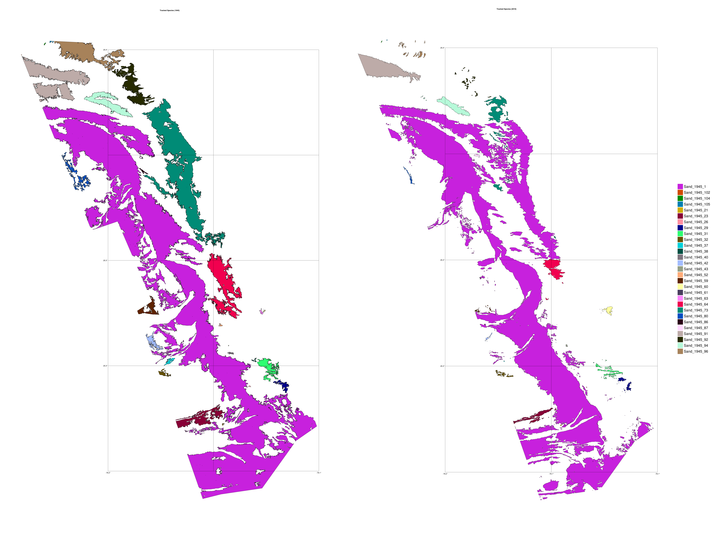

# This introduction includes the steps to track habitats and calculate the basic statistics

The workflow to conduct the analysis include the following steps:
- use R package to track patches
- use GeoMakie to visualize the tracking
- use ArchGDAL to calculate the migration of patches
- Polulate the selected patches with cloudpoints

## Tracking habitat
R package PlantTracker is used in this part. The code are located in folder 'src/Convert'. More information could be found in [Stears et al., 2022](https://besjournals.onlinelibrary.wiley.com/doi/10.1111/2041-210X.13950). Only brief steps would be introduced herein.

### Step 1: convert2sf.r
This step is to convert the shapefiles to rds file that could be used later. 

### Step2: convert2inv.r
This step is to create inventory for the following step. In this step, users should  

### Step3: main function conducting patch tracking
This step carries out the tracking. 
Parameters you could tweak:
1. dorm: time interval you would like to track.
2. buff: spatially, the maxium  distance that could be considered as overlapping
3. buffgenet: max distance for grouping patches into a bigger patch
4. clonal: habitat types you would like to trace

write the results in GeoJSON.

In this case, we tracked all the habitat types including islands, microfilm, macroalgae, sand, seagrass, and reef.

## Visualization
Located in Folder 'src/VisuliazeTracking/tracking_vis.jl'.
GeoMakie package in Julia is used in this step. This steps aims for manually checking the results of tracking is reasonable. 
The paramters you could change:
1. source: the source coordination systems of your input data. In my case, it's WGS84 18N.
2. dest: the coordination system that the above source file should be projected to. GeoMakie defaultly prefer WGS84.
3. tag: the habitat type you would like to visualize. In this case, the 'sand' habitat is targeted. 
4. data: path where you stored your tracking results.

The following figure is an example of tracking.

## Calculate migration statistics
Located in Folder 'src/CalculateMigration/migration_all.jl'.
After manually checking the tracking is reasonable, we then should calculate the migration statistics of the pacthes. We herein assume the pacthes would migration through the observation time intervals.
The parameters you could change:
1. filepath: path where you stored your tracking results.
2. targetspecies: the habitat type you would like to calculate.

The results are looked like the following table: 

| Tracking number | Migration direction (degrees) | Migration rates (m) |
| :--------------  | :--------------------- | :------------------ |
| Macroalgae_1945_11 | 279.90773675821083 | 193.09215794022163 |
| Macroalgae_1945_12 | 216.34172369277553 | 47.952615635581054 |
etc...

## Cloudpoint generation
Located in Folder 'src/RasterizeGeoJSON/rejectsampling.jl'
This step enables users to digitize the patch and generate a normalized cloudpoint for individual patch.
The default setting is only digitizing the biggest five patches.
The parameters you could tweak:
1. PATH: path where you stored your tracking results.
2. txtPATH: the output path to store scaling factor. 
3. TARGET_NUMBER = how many points the users need for cloudpoints.
4. ANGLE: the angles to rotate the patches to 0 degrees.
5. Species: the habitat types you would like to generate cloudpoints. 
This file is able to carry out batch procesing.
The result is written in MAT format. 

## Plotting cores
Located in Folder "src/PlottingCores'
Three julia files are there, and the 'plottingcores.jl' is to generate plots for virtual cores from mat file, while the other two files are for the emipircal cores.

## Plot the patch statistics
Located in Folder "src/plot_patch_stats/plotting.jl"
This file enables visualization of patch statistics, including the mterics used in the paper: NP, MPA, ED, etc.

## Spatial Entropy Calculation
Located in Folder "src/SpatialEntropyCal"
Two files are presented. 
'GridingShape.jl' is a file to compare the spatial entropy of original shapefile and the input cloud points into STACKER.
'SpatialEntropy.jl' is a utility file has Spatial entropy functions, and also determine how this metric evolves with time.